# Arvix_research_agent

This repo aims to analyze research papers based on a user prompt on what
wants to be researched. Once the papers are read in from arxiv, AI Agents (Ollama and Gemini)
determine the relevance of each papers and generates summaries assessing each paper.
The result is then stored into a text file under the saved_papers folder

The following packages are needed:
python-dotenv
langchain-core
langchain-google-genai
langchain-ollama
langgraph
arxiv
pymupdf
requests
pyyaml
ollama

The diagram of the agent workflow is noted below

